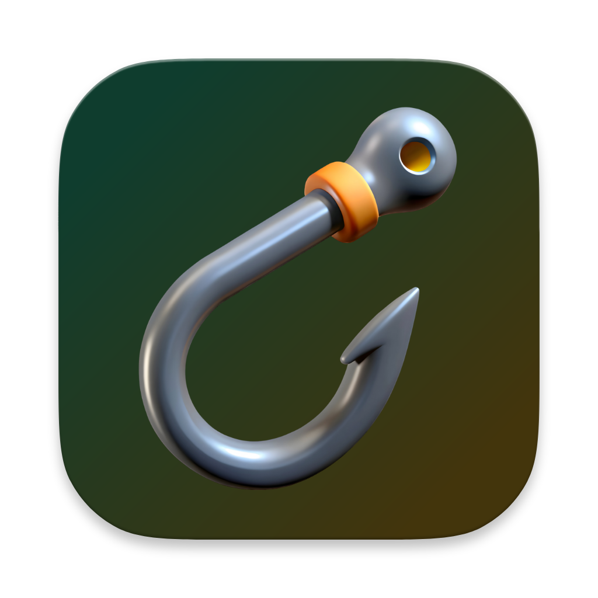
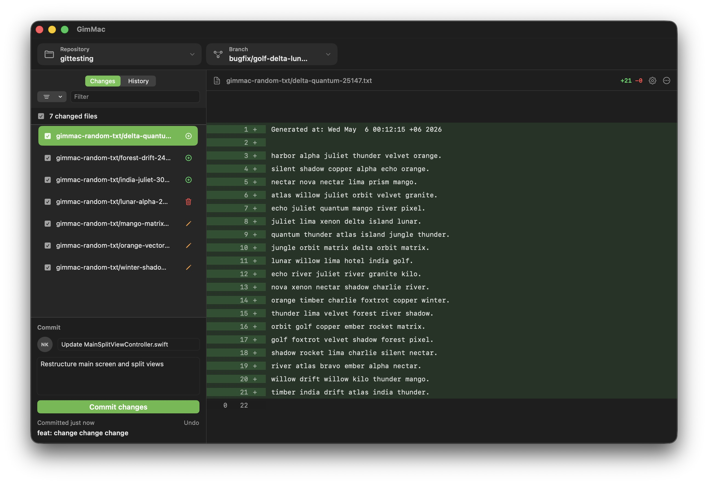

# GimMac

<p align="center">
  
</p>

<p align="center">
<b>Native macOS Git client inspired by the GitHub Desktop workflow.</b>
</p>

## Screenshot



## About

GimMac is a native macOS Git client focused on local Git workflows.

The MVP does not include GitHub platform-specific features. The app is inspired by GitHub Desktop interaction patterns, but aims for a native, AppKit-first implementation with fast local Git operations.

Target: roughly 60–70% functional parity with GitHub Desktop for core local workflows.

## Goals

- Native macOS Git client.
- AppKit-first interface.
- Fast local Git operations.
- GitHub Desktop-like workflow.
- Safe Git operations by default.
- GPG and SSH commit signing through existing Git configuration.
- Useful advanced actions such as squash, force-with-lease, branch switching, and diff review.

## Platform

- macOS 14.0+
- Swift
- AppKit-first UI
- System/Homebrew Git binary

## Documentation

- `PLAN.md` — scope, phases, architecture, risks.
- `DESIGN.md` — UI, state models, diff model, UX and security rules.
- `AGENTS.md` — contributor and AI-agent rules.

Suggested folders:

```text
docs/   contributor-facing technical docs
wiki/   user-facing notes and troubleshooting
```

## Build

This project uses XcodeGen.

Prerequisites:

- Xcode 26+
- [XcodeGen](https://github.com/yonaskolb/XcodeGen)
- [SwiftLint](https://github.com/realm/SwiftLint)

Commands:

```bash
xcodegen generate
xcodebuild -project GimMac.xcodeproj -scheme GimMac -destination 'platform=macOS' clean build
```

Strict gate:

```bash
brew install swiftlint
./scripts/strict-ci.sh
```

## Contributions

This project is maintained as a personal project.

Pull requests, patches, and external commits are not accepted unless explicitly requested by the maintainer.

You are free to fork the project under the license terms.

## Credits

Icon source: [3D Cartoon Style Hook with Orange Ring](https://www.vecteezy.com/png/51767337-3d-cartoon-style-hook-with-orange-ring) by [Munawar Hussain](https://buymeacoffee.com/pngstore) on Vecteezy.

## AI Disclosure

This project uses AI assistance during design and implementation.

## License

This project is free software: you can redistribute it and/or modify it under the terms of the GNU General Public License as published by the Free Software Foundation, either version 3 of the License, or any later version.

See `LICENSE`.
